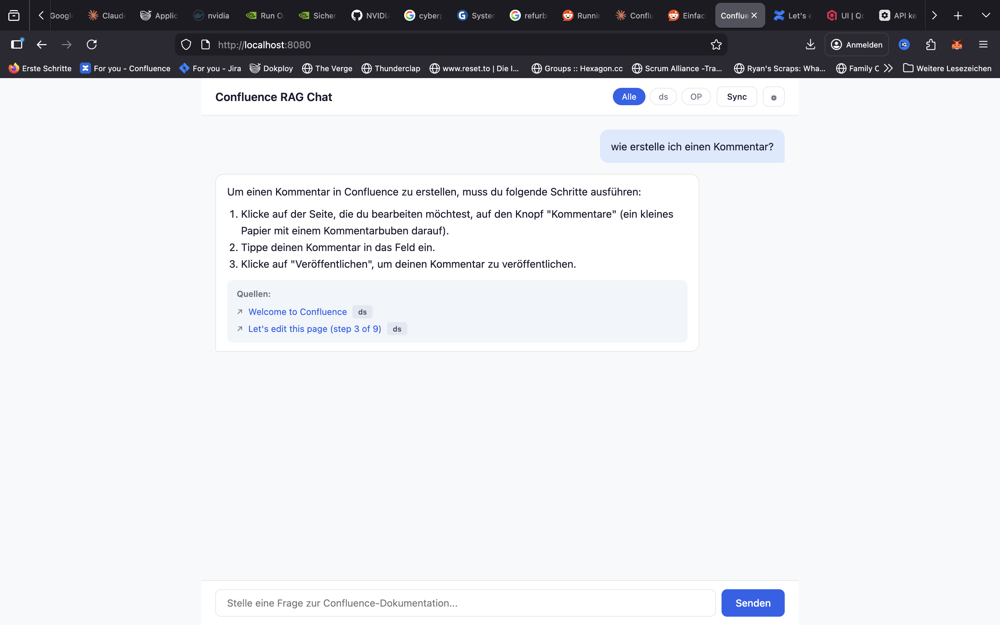

# Confluence RAG

KI-gestütztes Q&A über Confluence On-Premise Inhalte. Extrahiert Seiten, Kommentare und Attachments via REST API, verarbeitet sie in einer RAG-Pipeline und beantwortet Fragen über ein Chat-Interface mit Quellenangaben.



## Features

- **Confluence Crawler** — Extraktion via REST API mit PAT- oder Basic-Auth, inkl. PlantUML-Makros, Kommentare und PDF-Attachments
- **Inkrementeller Sync** — Nur geänderte Seiten werden erneut verarbeitet (CQL-basiert)
- **RAG-Pipeline** — Chunking mit Titel-/Label-/Pfad-Anreicherung, Overlap, Embedding (`bge-m3`, multilingual) und Similarity Search über Qdrant
- **Pluggable Reranker** — Drei Implementierungen über `Reranker`-Interface auswählbar: LLM-basiertes Listwise-Reranking via Ollama (Default, kein Extra-Container), externer Cross-Encoder via Infinity, oder NoOp-Passthrough
- **Chat-Interface** — Streaming-Antworten mit Quellenangaben, Space-Filter und Modell-Anzeige
- **Admin-Panel** — Ingest/Sync-Steuerung mit Live-Fortschrittsanzeige
- **Vollständig On-Premise** — LLM, Embedding und Reranker via Ollama, kein Cloud-Zwang, keine externen API-Aufrufe

## Tech Stack

| Schicht | Technologie |
|---|---|
| Sprache | Java 17+ |
| Framework | Spring Boot 3.4.3 + Spring AI 1.0.0 |
| HTML-Parsing | Jsoup |
| PDF-Extraktion | Apache Tika |
| VectorStore | Qdrant |
| LLM & Embedding | Ollama (Chat: gemma3:4b, Embedding: bge-m3, Reranker: qwen3:0.6b) |
| Frontend | Vanilla HTML/CSS/JS (kein Node.js nötig) |
| Infrastruktur | Docker Compose |

## Voraussetzungen

- Java 17+
- Maven 3.8+
- Docker + Docker Compose
- Confluence On-Premise (5.5+) mit PAT oder Basic Auth
- GPU empfohlen (für Ollama), CPU funktioniert auch
- Mind. 8 GB RAM (16 GB empfohlen für größere LLM-Modelle)

## Installation

Es gibt zwei Varianten: **Mit Docker** (empfohlen, einfacher) oder **ohne Docker** (alle Dienste nativ). Die App selbst ist in beiden Fällen eine Java-Anwendung.

### macOS

<details>
<summary><strong>Mit Docker (empfohlen)</strong></summary>

```bash
# Java 17 + Maven
brew install openjdk@17 maven
echo 'export JAVA_HOME=/opt/homebrew/opt/openjdk@17/libexec/openjdk.jdk/Contents/Home' >> ~/.zshrc
source ~/.zshrc

# Docker Desktop
brew install --cask docker
# Docker Desktop starten und warten bis es läuft

# Infrastruktur starten (Qdrant + Ollama)
docker compose up -d qdrant ollama

# Ollama-Modelle laden
docker compose exec ollama ollama pull bge-m3        # Embedding (1.2 GB)
docker compose exec ollama ollama pull gemma3:4b     # Chat (3.3 GB)
docker compose exec ollama ollama pull qwen3:0.6b    # Reranker (522 MB)
```

</details>

<details>
<summary><strong>Ohne Docker</strong></summary>

```bash
# Java 17 + Maven
brew install openjdk@17 maven
echo 'export JAVA_HOME=/opt/homebrew/opt/openjdk@17/libexec/openjdk.jdk/Contents/Home' >> ~/.zshrc
source ~/.zshrc

# Qdrant nativ
brew install qdrant
qdrant &  # Startet auf Port 6333/6334

# Ollama nativ
brew install ollama
ollama serve &  # Startet auf Port 11434
ollama pull bge-m3        # Embedding (1.2 GB)
ollama pull gemma3:4b     # Chat (3.3 GB)
ollama pull qwen3:0.6b    # Reranker (522 MB)
```

</details>

---

### Linux (Ubuntu/Debian)

<details>
<summary><strong>Mit Docker (empfohlen)</strong></summary>

```bash
# Java 17 + Maven
sudo apt update
sudo apt install -y openjdk-17-jdk maven
echo 'export JAVA_HOME=/usr/lib/jvm/java-17-openjdk-amd64' >> ~/.bashrc
source ~/.bashrc

# Docker
sudo apt install -y docker.io docker-compose-v2
sudo usermod -aG docker $USER
# Neu einloggen damit die Gruppenänderung greift

# Infrastruktur starten (Qdrant + Ollama)
docker compose up -d qdrant ollama

# Ollama-Modelle laden
docker compose exec ollama ollama pull bge-m3        # Embedding (1.2 GB)
docker compose exec ollama ollama pull gemma3:4b     # Chat (3.3 GB)
docker compose exec ollama ollama pull qwen3:0.6b    # Reranker (522 MB)
```

</details>

<details>
<summary><strong>Ohne Docker</strong></summary>

```bash
# Java 17 + Maven
sudo apt update
sudo apt install -y openjdk-17-jdk maven
echo 'export JAVA_HOME=/usr/lib/jvm/java-17-openjdk-amd64' >> ~/.bashrc
source ~/.bashrc

# Qdrant nativ
curl -L https://github.com/qdrant/qdrant/releases/latest/download/qdrant-x86_64-unknown-linux-musl.tar.gz | tar xz
./qdrant &  # Startet auf Port 6333/6334

# Ollama nativ
curl -fsSL https://ollama.com/install.sh | sh
ollama serve &  # Startet auf Port 11434
ollama pull bge-m3        # Embedding (1.2 GB)
ollama pull gemma3:4b     # Chat (3.3 GB)
ollama pull qwen3:0.6b    # Reranker (522 MB)
```

</details>

---

### Linux (RHEL/CentOS/Fedora)

<details>
<summary><strong>Mit Docker (empfohlen)</strong></summary>

```bash
# Java 17 + Maven
sudo dnf install -y java-17-openjdk-devel maven
echo 'export JAVA_HOME=/usr/lib/jvm/java-17-openjdk' >> ~/.bashrc
source ~/.bashrc

# Docker (RHEL/CentOS)
sudo dnf install -y dnf-plugins-core
sudo dnf config-manager --add-repo https://download.docker.com/linux/centos/docker-ce.repo
sudo dnf install -y docker-ce docker-ce-cli containerd.io docker-compose-plugin
sudo systemctl enable --now docker
sudo usermod -aG docker $USER
# Neu einloggen damit die Gruppenänderung greift

# Docker (Fedora alternativ)
# sudo dnf install -y docker docker-compose
# sudo systemctl enable --now docker
# sudo usermod -aG docker $USER

# Infrastruktur starten (Qdrant + Ollama)
docker compose up -d qdrant ollama

# Ollama-Modelle laden
docker compose exec ollama ollama pull bge-m3        # Embedding (1.2 GB)
docker compose exec ollama ollama pull gemma3:4b     # Chat (3.3 GB)
docker compose exec ollama ollama pull qwen3:0.6b    # Reranker (522 MB)
```

</details>

<details>
<summary><strong>Ohne Docker</strong></summary>

```bash
# Java 17 + Maven
sudo dnf install -y java-17-openjdk-devel maven
echo 'export JAVA_HOME=/usr/lib/jvm/java-17-openjdk' >> ~/.bashrc
source ~/.bashrc

# Qdrant nativ
curl -L https://github.com/qdrant/qdrant/releases/latest/download/qdrant-x86_64-unknown-linux-musl.tar.gz | tar xz
./qdrant &  # Startet auf Port 6333/6334

# Ollama nativ
curl -fsSL https://ollama.com/install.sh | sh
ollama serve &  # Startet auf Port 11434
ollama pull bge-m3        # Embedding (1.2 GB)
ollama pull gemma3:4b     # Chat (3.3 GB)
ollama pull qwen3:0.6b    # Reranker (522 MB)
```

</details>

---

### Windows

<details>
<summary><strong>Mit Docker (empfohlen)</strong></summary>

```powershell
# Java 17 + Maven
winget install EclipseAdoptium.Temurin.17.JDK
winget install Apache.Maven
setx JAVA_HOME "C:\Program Files\Eclipse Adoptium\jdk-17.x.x-hotspot"
# Pfad anpassen je nach Version, neues Terminal öffnen

# Docker Desktop
winget install Docker.DockerDesktop
# Docker Desktop starten und warten bis es läuft

# Infrastruktur starten (Qdrant + Ollama)
docker compose up -d qdrant ollama

# Ollama-Modelle laden
docker compose exec ollama ollama pull bge-m3        # Embedding (1.2 GB)
docker compose exec ollama ollama pull gemma3:4b     # Chat (3.3 GB)
docker compose exec ollama ollama pull qwen3:0.6b    # Reranker (522 MB)
```

</details>

<details>
<summary><strong>Ohne Docker</strong></summary>

```powershell
# Java 17 + Maven
winget install EclipseAdoptium.Temurin.17.JDK
winget install Apache.Maven
setx JAVA_HOME "C:\Program Files\Eclipse Adoptium\jdk-17.x.x-hotspot"
# Pfad anpassen je nach Version, neues Terminal öffnen

# Qdrant nativ
# Download: https://github.com/qdrant/qdrant/releases (Windows Binary)
# Entpacken und starten:
.\qdrant.exe  # Startet auf Port 6333/6334

# Ollama nativ
winget install Ollama.Ollama
ollama serve  # In separatem Terminal, startet auf Port 11434
ollama pull bge-m3        # Embedding (1.2 GB)
ollama pull gemma3:4b     # Chat (3.3 GB)
ollama pull qwen3:0.6b    # Reranker (522 MB)
```

</details>

---

**Hinweis Windows:** Umgebungsvariablen werden unter Windows anders übergeben. Statt Inline-Variablen eine `.env`-Datei nutzen oder die Variablen vorher setzen:

```powershell
$env:CONFLUENCE_USERNAME="admin"
$env:CONFLUENCE_PASSWORD="admin"
$env:CONFLUENCE_SPACES="DEV,OPS"
mvn spring-boot:run -DskipTests
```

### Installation verifizieren

```bash
java -version          # Sollte 17.x.x zeigen
mvn -version           # Sollte 3.8+ zeigen
```

Mit Docker zusätzlich:

```bash
docker --version       # Sollte 20+ zeigen
docker compose version # Sollte 2.x zeigen
```

Ohne Docker zusätzlich:

```bash
curl http://localhost:6333/healthz     # Qdrant: "ok"
curl http://localhost:11434/api/tags   # Ollama: Modell-Liste
```

## Schnellstart

### 1. Repository klonen

```bash
git clone https://github.com/martinvidec/openaustria-confluence-rag.git
cd openaustria-confluence-rag
```

### 2. Infrastruktur starten

```bash
docker compose up -d qdrant ollama
```

### 3. Ollama-Modelle laden

Via Docker:

```bash
docker compose exec ollama ollama pull bge-m3        # Embedding — multilingual, top-Tier auf DE (1.2 GB)
docker compose exec ollama ollama pull gemma3:4b     # Chat — Default für Antwort-Generierung (3.3 GB)
docker compose exec ollama ollama pull qwen3:0.6b    # Reranker — Listwise Rerank, optional (522 MB)
```

Oder falls Ollama nativ installiert ist:

```bash
ollama pull bge-m3
ollama pull gemma3:4b
ollama pull qwen3:0.6b
```

> **Hinweis:** Der Reranker ist optional. Mit `QUERY_RERANKER_TYPE=none` wird die rohe Vektor-Reihenfolge benutzt und `qwen3:0.6b` muss nicht gepullt werden.

### 4. Anwendung starten

**macOS / Linux:**

```bash
# Mit PAT (Confluence 7.9+):
CONFLUENCE_PAT=dein-token CONFLUENCE_SPACES=DEV,OPS mvn spring-boot:run -DskipTests

# Mit Basic Auth (ältere Versionen oder lokaler Test):
CONFLUENCE_USERNAME=admin CONFLUENCE_PASSWORD=admin CONFLUENCE_SPACES=DEV,OPS mvn spring-boot:run -DskipTests
```

**Windows (PowerShell):**

```powershell
$env:CONFLUENCE_USERNAME="admin"
$env:CONFLUENCE_PASSWORD="admin"
$env:CONFLUENCE_SPACES="DEV,OPS"
mvn spring-boot:run -DskipTests
```

### 5. Initialen Crawl starten

```bash
curl -X POST http://localhost:8080/api/admin/ingest
```

Unter Windows ohne curl: http://localhost:8080/api/admin/ingest im Browser als POST senden (z.B. mit Postman) oder PowerShell:

```powershell
Invoke-RestMethod -Method Post -Uri http://localhost:8080/api/admin/ingest
```

### 6. Chat-UI öffnen

```
http://localhost:8080
```

## Lokales Test-Setup (Confluence On-Premise)

Für ein realistisches Testszenario kann Confluence 8.5 lokal per Docker gestartet werden:

```bash
docker compose -f docker-compose.test.yml up -d
```

Dann unter http://localhost:8090 den Setup-Wizard durchlaufen (Evaluierungs-Lizenz über my.atlassian.com).

## Konfiguration

### Confluence

| Variable | Beschreibung | Default |
|---|---|---|
| `CONFLUENCE_BASE_URL` | Confluence Server URL | `http://localhost:8090` |
| `CONFLUENCE_PAT` | Personal Access Token (Confluence 7.9+) | — |
| `CONFLUENCE_USERNAME` | Basic Auth Username (Alternative zu PAT) | — |
| `CONFLUENCE_PASSWORD` | Basic Auth Passwort | — |
| `CONFLUENCE_SPACES` | Komma-separierte Space-Keys | — |

### LLM & Embedding

| Variable | Beschreibung | Default |
|---|---|---|
| `OLLAMA_BASE_URL` | Ollama API URL | `http://localhost:11434` |
| `OLLAMA_CHAT_MODEL` | Chat-Modell für die Antwort-Generierung | `gemma3:4b` |
| `OLLAMA_EMBEDDING_MODEL` | Embedding-Modell (multilingual) | `bge-m3` |

### Infrastruktur

| Variable | Beschreibung | Default |
|---|---|---|
| `QDRANT_HOST` | Qdrant Host | `localhost` |
| `QDRANT_GRPC_PORT` | Qdrant gRPC Port | `6334` |

### Ingestion-Tuning

| Variable | Beschreibung | Default |
|---|---|---|
| `CHUNK_SIZE` | Chunk-Größe in Tokens | `500` |
| `CHUNK_OVERLAP` | Overlap zwischen Chunks in Tokens | `50` |
| `BATCH_SIZE` | Batch-Größe für Qdrant-Upserts | `50` |
| `INGESTION_PARALLEL_THREADS` | Parallele Embedding-Threads | `2` |
| `INGESTION_CHUNK_TIMEOUT` | Timeout pro Batch in Sekunden | `300` |
| `VECTOR_DIMENSION` | Dimension der Embedding-Vektoren (muss zum Modell passen) | `1024` |

### Query-Tuning

| Variable | Beschreibung | Default |
|---|---|---|
| `QUERY_TOP_K` | Anzahl Ergebnisse nach Reranking | `5` |
| `QUERY_SIMILARITY_THRESHOLD` | Min. Cosine-Similarity für Kandidaten aus Qdrant | `0.45` |

### Reranker

Drei Modi via `@ConditionalOnProperty` bei Startup auswählbar — genau eine Bean ist aktiv:

| Variable | Beschreibung | Default |
|---|---|---|
| `QUERY_RERANKER_TYPE` | `llm` \| `infinity` \| `none` | `llm` |

**Bei `type=llm` (Default):** Listwise-Reranking via Ollama, kein extra Container.

| Variable | Beschreibung | Default |
|---|---|---|
| `QUERY_RERANKER_LLM_URL` | Ollama-Endpoint für den Rerank-Call | `http://localhost:11434` |
| `QUERY_RERANKER_LLM_MODEL` | Ollama-Modell für den Rerank | `qwen3:0.6b` |
| `QUERY_RERANKER_LLM_CANDIDATES` | Anzahl Kandidaten die in den Reranker gehen | `15` |
| `QUERY_RERANKER_LLM_TIMEOUT` | Timeout für den Rerank-Call (Sekunden) | `60` |
| `QUERY_RERANKER_LLM_MAX_CHUNK` | Truncation pro Chunk im Prompt (Zeichen) | `500` |

**Bei `type=infinity`:** Externer Cross-Encoder-Container ([`michaelf34/infinity`](https://github.com/michaelf34/infinity), bereits im `docker-compose.yml` als optionaler Block enthalten). Höhere Präzision, ~4.5 GB Image — sinnvoll wenn das Image in einer privaten Registry verfügbar ist.

| Variable | Beschreibung | Default |
|---|---|---|
| `QUERY_RERANKER_INFINITY_URL` | URL des Infinity-Containers | `http://localhost:7997` |
| `QUERY_RERANKER_INFINITY_MODEL` | Cross-Encoder-Modell | `BAAI/bge-reranker-v2-m3` |
| `QUERY_RERANKER_INFINITY_CANDIDATES` | Anzahl Kandidaten | `30` |
| `QUERY_RERANKER_INFINITY_TIMEOUT` | Timeout (Sekunden) | `10` |

**Bei `type=none`:** Reranker deaktiviert, rohe Vektor-Reihenfolge wird verwendet.

## API-Endpunkte

| Methode | Pfad | Beschreibung |
|---|---|---|
| `POST` | `/api/chat` | Synchrone Frage-Antwort |
| `POST` | `/api/chat/stream` | Streaming via SSE |
| `GET` | `/api/spaces` | Verfügbare Spaces |
| `POST` | `/api/admin/ingest` | Vollständigen Crawl + Ingestion starten (löscht alte Chunks) |
| `POST` | `/api/admin/ingest/{spaceKey}` | Einzelnen Space ingesten |
| `POST` | `/api/admin/sync` | Inkrementellen Sync starten |
| `POST` | `/api/admin/sync/{spaceKey}` | Space-Sync |
| `GET` | `/api/admin/job/status` | Aktueller Job-Status mit Fortschritt |
| `GET` | `/api/admin/sync/status` | Sync-Status pro Space |
| `GET` | `/actuator/health` | Health Check (Qdrant, Ollama, Confluence) |

## Architektur

```
┌──────────────┐     ┌──────────────────┐     ┌─────────┐
│  Confluence   │────▶│  Crawler Service  │────▶│  Jsoup  │
│  REST API     │     │  (PAT/Basic Auth, │     │  + Tika │
└──────────────┘     │   Pagination)     │     └────┬────┘
                      └──────────────────┘          │
                                                     ▼
┌──────────────┐     ┌──────────────────┐     ┌──────────────────┐
│   Ollama      │◀───│  Ingestion        │◀───│ Chunking Pipeline │
│  (bge-m3)     │───▶│  Service          │───▶│ (Titel/Label/Pfad │
└──────────────┘     │  (parallel batch) │    │  Anreicherung +   │
                      └──────────────────┘     │  Overlap)         │
                              │                 └──────────────────┘
                              ▼
                      ┌──────────┐
                      │  Qdrant  │
                      │ 1024-dim │
                      └────┬─────┘
                           │
                           ▼
┌──────────────┐     ┌────────────────────┐    ┌──────────────────┐
│   Ollama      │◀───│  Query Service     │───▶│  Reranker (DI)    │
│  (Chat LLM    │───▶│  (Vector Search →  │    │  - LlmListwise    │
│  gemma3:4b)   │    │   Reranker → LLM)  │◀───│  - Infinity X-Enc │
└──────────────┘     └─────────┬──────────┘    │  - NoOp           │
                               │                └──────────────────┘
                               ▼
                       ┌──────────────────┐
                       │   Chat Frontend   │
                       │  (HTML/JS + SSE)  │
                       └──────────────────┘
```

Der `Reranker` ist ein Interface mit drei austauschbaren Implementierungen — die aktive Bean wird beim Startup über `@ConditionalOnProperty` ausgewählt (siehe [Konfiguration → Reranker](#reranker)).

## Projektstruktur

```
src/main/java/at/openaustria/confluencerag/
├── config/          # ConfluenceProperties, IngestionProperties, QueryProperties, Health, CORS
├── crawler/         # CrawlerService, AttachmentTextExtractor
│   ├── client/      # ConfluenceClient (REST API, Pagination, Retry)
│   ├── converter/   # ConfluenceHtmlConverter, MacroHandlers (PlantUML etc.)
│   └── model/       # DTOs (ConfluencePageResponse, ConfluenceDocument etc.)
├── ingestion/       # ChunkingService, IngestionService, SyncService, SyncScheduler
├── query/           # QueryService, Reranker (interface) + 3 implementations,
│                    #   QueryRequest/Response, Source
└── web/             # ChatController, AdminController, GlobalExceptionHandler

src/main/resources/
├── application.yml
├── application-dev.yml
└── static/          # Chat-UI (index.html, CSS, JS)

docs/
├── Confluence_RAG_Konzept.md
├── MVP_Phasenplan.md
└── specs/           # Implementierungs-Specs + Roadmap-/Analyse-Dokumente

scripts/
├── generate-test-pages.py        # Erzeugt Test-Seiten im lokalen Confluence
└── retrieval-quality-check.py    # Diagnose-Tool: Vector vs. Reranker side-by-side
```

## Diagnose-Tools

`scripts/retrieval-quality-check.py` führt eine konfigurierbare Test-Query-Liste gegen die ingestete Qdrant-Collection aus und zeigt pro Query die Top-K — wahlweise als reine Vektor-Suche, nach Rerank, oder side-by-side mit Rang-Änderungs-Pfeilen. Sehr nützlich beim Vergleichen von Embedding-Modellen, Threshold-Kalibrierung oder beim Spot-Check ob ein Reranker tatsächlich die richtigen Treffer hochzieht. Details: [`scripts/README.md`](scripts/README.md).

## Status

MVP implementiert, funktionsfähig und produktiv eingesetzt. Getestet mit Confluence 8.5 Data Center (Docker). 67 Unit-Tests.

## Lizenz

MIT
